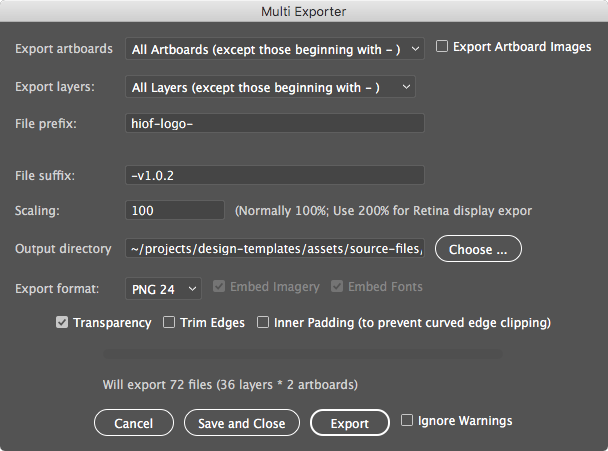
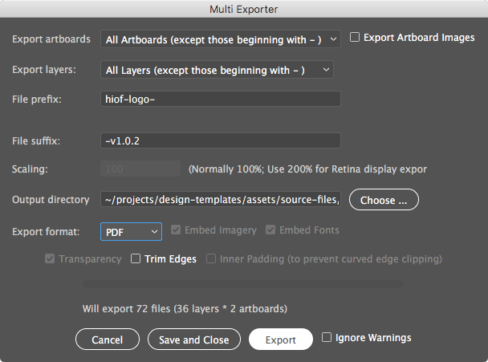

# Instructions on how to generate the logo files

The Høgskolen i Østfold / Østfold University College branding currently include 18 different versions set in black and white. The output files are available in four different formats;  EPS, JPG, PDF and PNG. This documentation will describe how you can edit the different versions in a single Adobe Illustrator source file and then generate 144 files required.

This project

## Required installation

1. Copy the MultiExporter.jsx file in this folder to the following location:
  - Mac: `~/Applications/Adobe\ Illustrator\ CC\ 2017/Presets.localized/en_US/Scripts/`
  - Windows: `C:\Program Files\Adobe\Adobe Illustrator CC 2017\Presets\en_US\Scripts`
2. Restart Illustrator if it is already open to see the new script in `File > Scripts > MultiExporter`.

## Do edits / create a new version
1. Create a new GIT branch for your edits. (New feature branch if there is a new version, a new )
2. Open the latest `logo-hiof-template-vX.X.X.ai` file in this folder.
  - Each layer group in the file represent a version of the logo.
3. If you are going to do edits or create a new subbranding, save the file as a duplicate with a version number bump in the filename.
  - Remember to outline any text layer.
4. Save your edits.
5. Export the new logos
  1. Make sure all the layer-folders you want to export is visible
  2. Make sure any helper layers (like the black backgrund for the white logos) are invisible.
  3. Run the MultiExporter script `File > Scripts > MultiExporter`. I recommend that you use the export-sibling folder in this directory as your export folder. You have to run the script for each output format.
    - Export illustration for PNG files : 
    - Export illustration for PDF files : 
    - Export illustration for JPG files : 
    - Export illustration for EPS files : 
    - Export illustration for SVG files : 
  4. Copy your newly generated files into a (new) folder in `/assets/public/` following the same naming convention as the previous logo-folders. Remember to bump the version number of the folder if you updated a previous version of the logo.
  5. Remember to change the reference to the new/changed logo in `./content/logo-nor.md`.
6. Commit your changes, merge your branch and tag the update with a bumped version number.
7. Push changes to the remote repo.

## Publish

Read the ./README.md file in this project.
